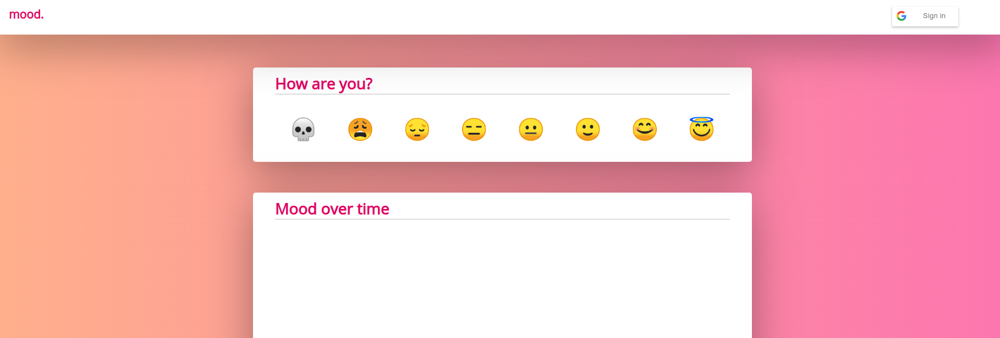

# mood. 😐

Badge | Status
----- | ------
License | MIT



"mood." is a simple progressive webapp I'm building to learn a few aspects of web development.

- Hosted on Zeit.co
- Responsive stylesheets built with modern CSS

## Features

- Stores mood over time in an offline-first fashion
- Displays a graph and analytics of mood over time

## Build System

Environment secrets are stored in a `.env` file with the following fields:

```
# -- google signin client id
GOOGLE_CLIENT_ID=xxx

# -- encryption key for application data
ENCRYPTION_KEY=xxx

# -- private key for google signin
GOOGLE_PRIVATE_KEY=xxx

# -- limited-access basic-auth credentials for synthetic monitoring
TEST_ACCOUNT_CREDENTIAL=xxx
```

### Building
```
build           compile client-side code into 'public' folder using webpack
```

### Deployment
```
deploy          deploy the website and associated apis to Zeit
```

### Running
```
run:api         run the site's apis locally directly
run:client      run the site's static-serve locally directly
dev             run the site using docker-compose
```
